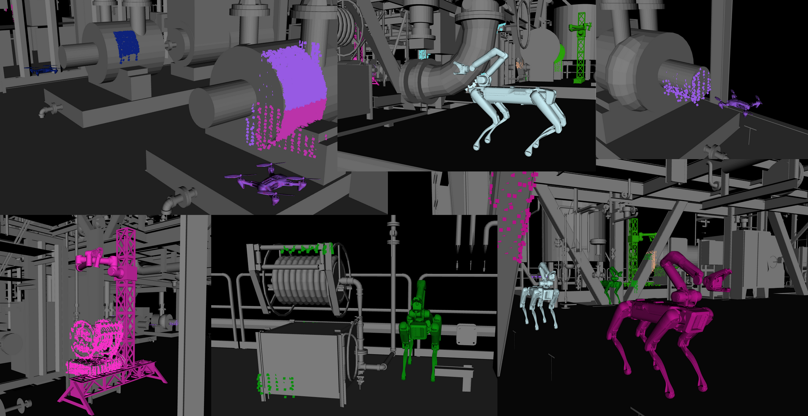
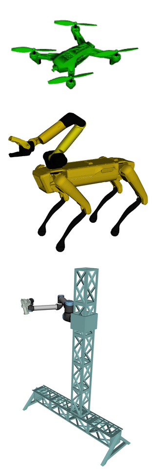
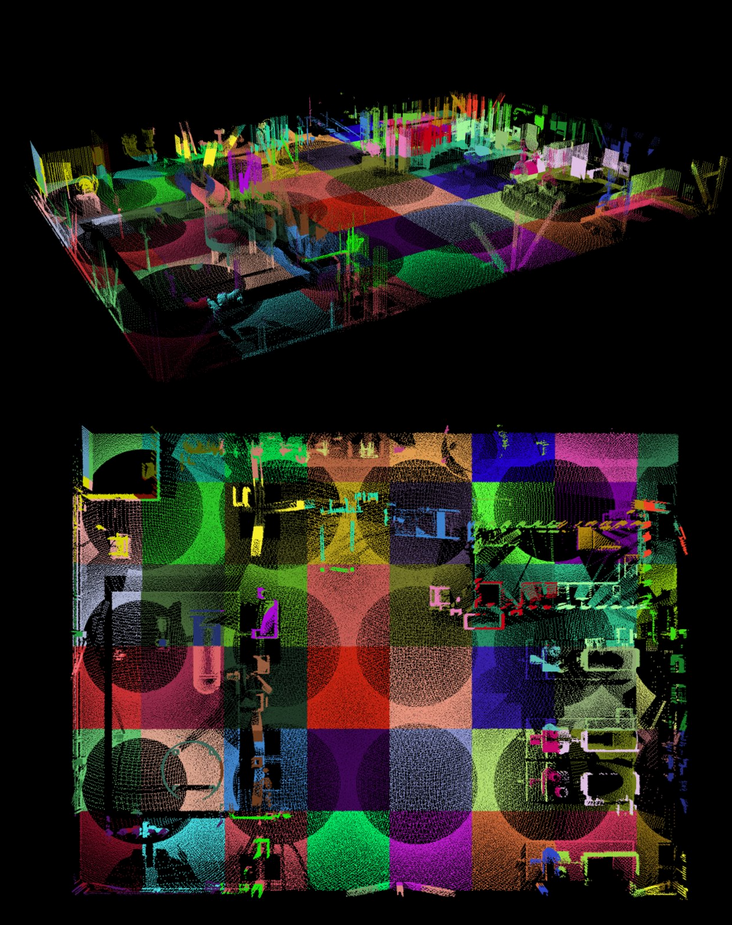
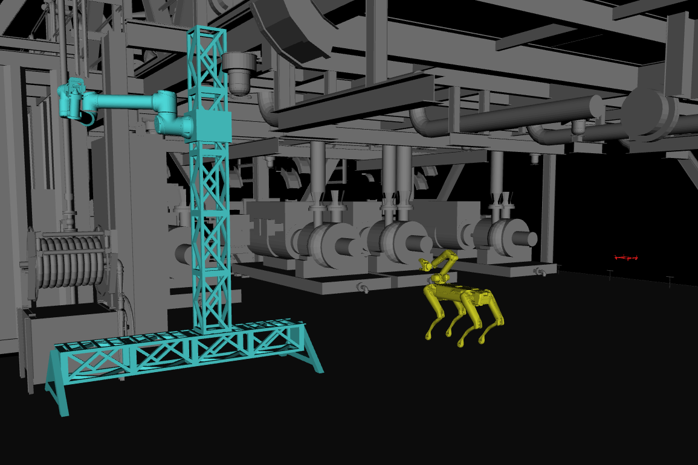

# We Paint! : Game-Theoretic Modeling for Robot Platform Selection in Industrial Fabric Maintenance Applications



## About
This project aims to compare the capabilities of different robotic platforms for performing fabric maintenance applications in industrial environments and optimize team composition for performance under time and cost constraints.

## Contents
**coverage_contest** contains player and board definitions and solution procedures to play the game. 

## Requirements, Dependencies, and Building
These packages are built and tested on a system running ROS1 noetic on Ubuntu 20.04. However, the project is written entirely in C++ and wrapped in a thin ROS wrapper for visualization purposes, so it can easily be compiled and run independently of ROS, just without visualiations. 

1. Create a Catkin workspace:
```
mkdir -p catkin_ws/src && cd catkin_ws
```
2. Clone the contents of this repository:
```
git clone https://github.com/steven-swanbeck/game_theoretic_painting.git src/
```
3. Install all package dependencies:
```
rosdep update
```
```
rosdep install --from-paths src --ignore-src -r -y
```
4. Build and source the workspace
```
catkin build
```
```
source devel/setup.bash
```
5. Download meshes and clouds used for demonstraion by following the instructions in ```coverage_contest/models/info.txt```.

## Running the Game
Parameters for numbers of players, game and repair board files and discretizations, and Monte Carlo tree search parameters can be changed in ```config/params.yaml```. Then run 

```
roslaunch coverage_contest load_game
```
in one terminal, followed by 
```
rosservice call /play_game
```
in a separate terminal to simulate the full game.


[](https://github.com/steven-swanbeck/game_theoretic_painting/assets/99771915/644db458-211a-4ba5-9886-ede0299eddec)


## Additional Info

Currently supported robot types are drones, qunarupeds, and gantries.



The game board is built using input point clouds that represent the map of the environment and the material within it that must be repaired.



The robots play on this board until all material in the environment has been repaired.


